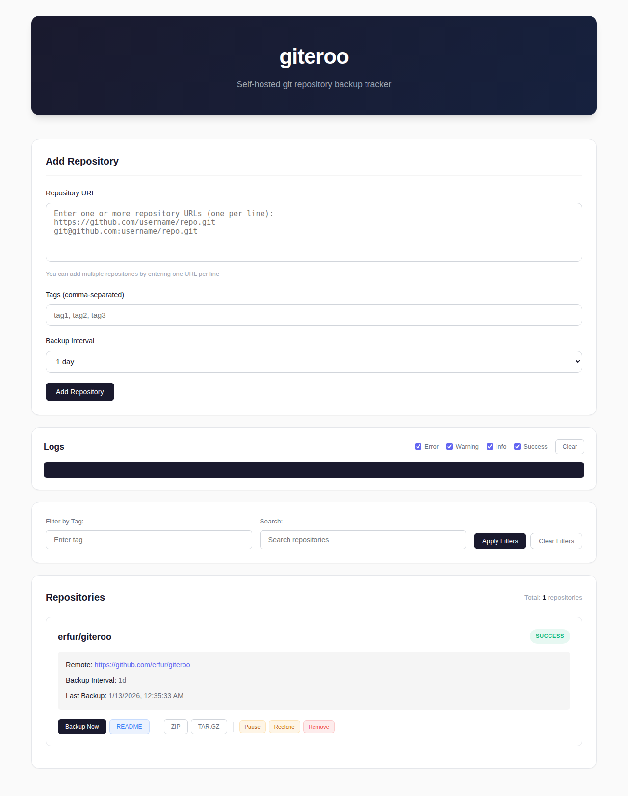

# giteroo

Self-hosted web application for tracking and backing up remote git repositories.

> **AI Disclaimer**: This project was built with AI assistance using Cursor. The AI did its best, but it's not perfect - please review the code before trusting it with your precious repositories in production!

## Features

- **Repository Management**: Add, track, and manage multiple git repositories
- **Automated Backups**: Schedule backups at intervals (15m, 1h, 6h, 1d, 1w)
- **Bulk Operations**: Add multiple repositories at once
- **Status Monitoring**: Real-time status with color-coded indicators
- **Filtering**: Filter by tag or search string
- **Snapshot Downloads**: Download repositories as ZIP or TAR.GZ
- **Log Box**: View application logs with severity filtering
- **Notifications**: Non-invasive toast notifications for errors and warnings
- **README Display**: View repository README files with markdown rendering

## Screenshot



## Quick Start

### Docker (Recommended)

```bash
docker-compose up -d
```

Access at `http://localhost:8000`

### Manual Installation

```bash
npm install
npm start
```

Access at `http://localhost:3000`

## Configuration

Environment variables:
- `PORT`: Server port (default: 3000)
- `REPOSITORIES_DIR`: Repository storage directory (default: `/app/repositories`)
- `LOGS_DIR`: Log files directory (default: `/app/logs`)
- `DB_PATH`: SQLite database path (default: `/app/data/giteroo.db`)

## Usage

1. **Add Repository**: Enter git URL(s), optionally add tags, select backup interval
2. **Manage**: Use repository widget buttons to backup, reclone, download, or remove
3. **Filter**: Use tag or search filters to find specific repositories
4. **View Logs**: Check log box for application activity and errors

## Data Storage

- Repositories: `/app/repositories/<username>/<repo_name>`
- Database: `/app/data/giteroo.db`
- Logs: `/app/logs/` (rotating daily)

## Security

- Input sanitization prevents path traversal
- Command injection protection via proper shell escaping
- XSS protection via HTML sanitization

See `SECURITY_FIXES.md` for details.
